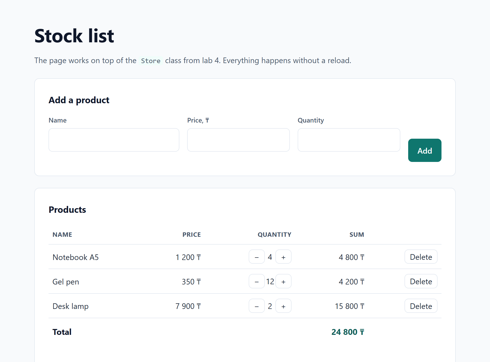
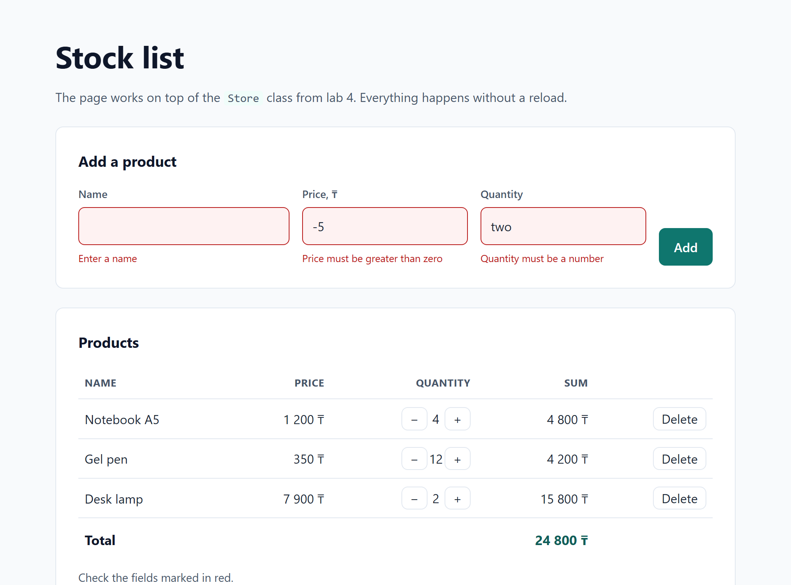

# Stock list, DOM, events and forms

Study project for the web course, Lab 5. An interactive product page built on the `Store` class from Lab 4 (js-core-medetbek). Plain JavaScript and the DOM API, no frameworks and no build step.

Repository: https://github.com/kanzharat/dom-store-medetbek

Live site: https://kanzharat.github.io/dom-store-medetbek/

## How to open it

Open the live site, or download the repository and open `index.html` in a browser, double click is enough. There is nothing to install and no server is needed: the scripts are loaded as classic `<script>` tags, not modules, so the page also works from `file://`.

## What it does

- The table is drawn from `store.list()`, not written in the HTML by hand. `index.html` ships with an empty `<tbody>`.
- The form adds a product. Errors appear under the field, in red, and the field itself is highlighted. No `alert` anywhere.
- Each row has a minus and a plus button for the quantity and a delete button.
- The total under the table is recalculated from `store.total()` after every change, without a reload.
- The page starts with three products so it is not empty on the first open.

### Validation rules

| Field | Error |
|---|---|
| Name | empty, or the product is already in the list |
| Price | empty, not a number, or less than or equal to zero |
| Quantity | empty, not a number, not a whole number, or less than 1 |

A price may be written with a comma or a dot, `2500,50` and `2500.50` are both accepted. An error disappears as soon as you start typing in that field again.

## Which events I handled and why

The form uses `submit` and not a `click` on the button, because `submit` also fires on the Enter key, and one `event.preventDefault()` there stops the page from reloading, which is what keeps the total live. The table has a single `click` listener instead of one per button: the rows are recreated on every render, so listeners bound to the old buttons would be lost, while one listener on the parent keeps working for rows that do not exist yet. Inside that handler `event.target.closest('button[data-action]')` finds which button was pressed, the `data-action` attribute says what to do and the `data-name` of the row says with which product, so delete, plus and minus share one function. The third listener is `input` on the form, also delegated, and it clears the error message of the field being typed into, so the red text does not stay on screen after the mistake is fixed. All three listeners end in the same `render()` call, which redraws the rows and the total from the store, so the DOM can never disagree with the data.

## Screenshots

The page with the list and the live total:

The form after pressing Add with an empty name, a negative price and a quantity that is not a number:

## Checks

The page was driven in headless Chrome: 21 checks for the render, the validation messages, the delegated buttons and the total, all passing. Checked that `Add` with bad data changes nothing in the list, that the total follows plus, minus and delete, and that the empty list shows a message and a total of 0.

## AI tools

Gemini was used to understand the assignment text and to write the comments in the code. The markup, the styles and the JavaScript were written and checked by hand and can be explained line by line.

## Structure

- index.html, the markup, with an empty `tbody` that JavaScript fills
- css/style.css, the styles
- js/Store.js, the `Store` class from lab 4, with `setQty` added for the quantity buttons
- js/app.js, the DOM layer: render, validation and the event listeners
- screenshots/, the page and the validation state
